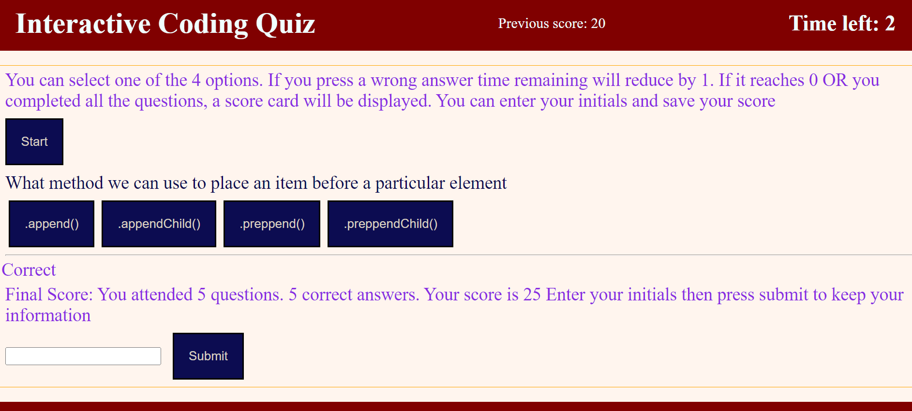

# Interactive Coding Quiz

## Installation
N/A

[To visit my Interactive Coding Quiz Web Site]( https://ajilakj.github.io/Interactive-Coding-Quiz/)

## Description
This is an interactive coding quiz. The questions are based on JavaScript.

## Usage
- To use this website you can click the start button.
- You can select one of the 4 options.
- If you press a wrong answer time remaining will reduce by 1.
- If it reaches 0 OR you completed all the questions, a score card will be displayed.
- You can enter your initials and save your score 

## Credits
N/A

## License
N/A
